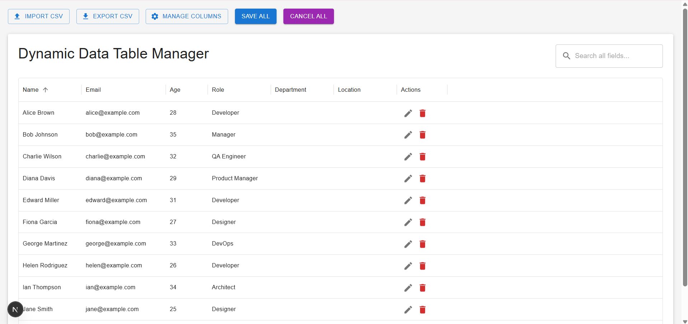
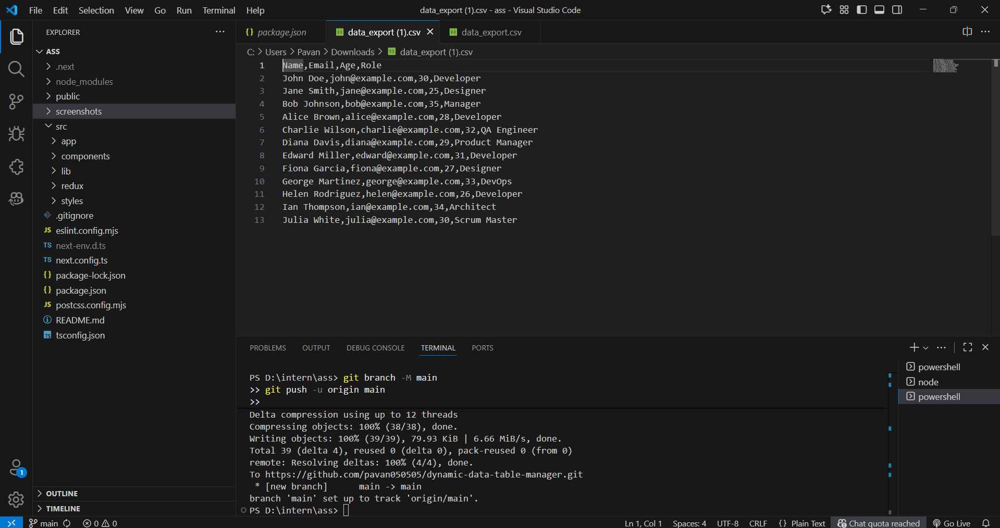

# 📊 Dynamic Data Table Manager

A modern, fully responsive **Dynamic Data Table Manager** built using **Next.js**, **Redux Toolkit**, and **Material UI (MUI)**.  
This project demonstrates advanced front-end development skills such as **state management**, **dynamic UI rendering**, **CSV import/export**, and **inline editing** — ideal for real-world dashboard or admin panel use cases.

---

## 🚀 Features

### 🧩 Core Functionalities
- **Dynamic Data Table** with default columns: `Name`, `Email`, `Age`, `Role`
- **Sorting** (Ascending/Descending) on all columns  
- **Global Search** — filters across all fields  
- **Pagination** — client-side, 10 rows per page  

### ⚙️ Manage Columns
- Add new fields dynamically (e.g., Department, Location)  
- Show/Hide existing columns using checkboxes  
- Changes persist using **localStorage** / **Redux Persist**

### 📥 CSV Import
- Upload CSV file and parse using **PapaParse**
- Displays error messages for invalid formats

### 📤 CSV Export
- Export the current visible table data to `.csv`
- Includes only visible columns

---

## 🎁 Bonus Features
- 🔄 **Inline Row Editing** (Double-click to edit values)
- 🗑️ **Row Actions** (Edit, Delete with confirmation)
- 🌗 **Theme Toggle** (Light / Dark mode via MUI)
- 🧭 **Column Reordering** (Drag-and-drop)
- 📱 **Fully Responsive Design**

---

## 🛠️ Tech Stack

| Technology | Purpose |
|-------------|----------|
| **Next.js 14** | Framework for React (App Router) |
| **React 18** | UI library |
| **Redux Toolkit** | State management |
| **Material UI (MUI)** | Modern UI components |
| **TypeScript** | Type-safe development |
| **React Hook Form** | Form management |
| **PapaParse** | CSV parsing |
| **FileSaver.js / Blob** | Export CSV functionality |
| **Redux Persist / localStorage** | Data persistence |

---

## 📸 Screenshots

### 🏠 Dashboard View





> Example: Dynamic table with sorting, search, and column management.

---

## ⚡ Installation and Setup

### 1️⃣ Clone the Repository
```bash
git clone https://github.com/pavan050505/dynamic-data-table-manager.git

### 2️⃣ Install Dependencies
npm install

### 3️⃣ Run the Development Server
npm run dev
Visit http://localhost:3000
 to preview your app 🎨

### 🧩 Folder Structure

src/
 ├── app/
 │   ├── layout.tsx
 │   ├── page.tsx
 │   └── globals.css
 ├── components/
 ├── redux/
 ├── lib/
 └── styles/

📦 Build for Production
npm run build
npm start

🧠 Learning Outcomes

Handling dynamic UI updates with React & Redux
Using MUI Table and managing client-side state
Implementing CSV import/export
Applying responsive design principles
Persisting UI preferences in localStorage

🧑‍💻 Author

Pavan Sanjay Bhosle
🎓 B.Tech in Artificial Intelligence and Data Science
💼 Frontend Developer | AI & Web Enthusiast
📧 pavanbhosle0505@gmail.com

⭐ If you like this project, please give it a star on GitHub!
